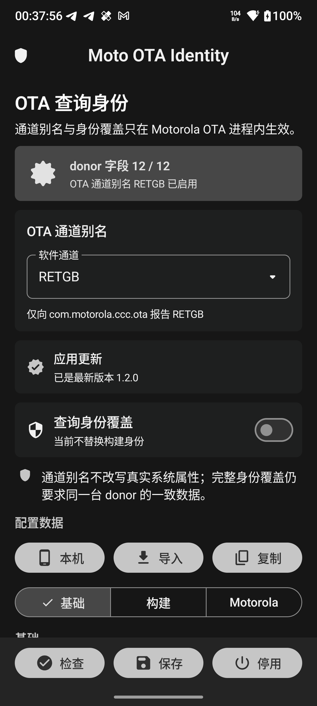

# Moto OTA Identity

[English](#english)

一个范围严格受限的 LSPosed 模块，用于给 Motorola 软件更新客户端设置进程内通道别名，并可选替换发送给服务器的设备选择 JSON。配置界面采用 Google Material 3 Expressive。通道别名默认使用 `RETGB`，完整 donor 身份覆盖默认关闭。

<p align="center">
  
</p>

## 它会做什么

- 只在 `com.motorola.ccc.ota` 进程内 Hook `BuildPropReader.getCarrierName(...)` 和 `getExtraInfoAsJsonObject(...)`。
- 可将 OTA 客户端读取的 `channel_id` 临时别名为 `RETGB`、`TELEU`、`RETAPAC` 或 `RETEU`；默认选择 `RETGB`。
- 通道别名独立于完整 donor 配置工作，只改变 OTA 进程看到的通道和查询 JSON 的 `carrier`。
- 可选替换 OTA 查询 JSON 中的构建、产品和 Motorola 映射字段；完整身份覆盖默认关闭。
- 从模块自身的只读 `ContentProvider` 获取配置；provider 只接受模块自身和 Motorola OTA UID。
- 先验证整套 donor 配置，再在 JSON 副本上原子应用；任何异常都保留原始请求。
- 应用入口不会出现在桌面，只能从 LSPosed 模块详情页打开。
- 每次打开模块界面时自动检查 GitHub Release；新版 APK 下载后必须通过随 Release 发布的 SHA-256，再交给 Android 系统安装器确认。

## 它明确不会做什么

- 不会把服务器的 `proceed:false` 强制改成 `true`。
- 不会修改服务器响应、真实 `channel_id`、全局系统属性、SKU、CID、IMEI 或 MCC/MNC。
- 不会绕过源版本 fingerprint、payload 签名、分区哈希、回滚保护或 `update_engine` 校验。
- 不会保证某台不同硬件 SKU 的设备一定能获得或安装 OTA。

服务器返回 `ERR_NOTFOUND`、`ALREADY_UP_TO_DATE` 或 `proceed:false` 时，说明当前整套请求身份没有匹配到可下发路径。单独伪装国家或强改一个 fingerprint 通常不够，而且绕过安装校验可能让设备无法启动。本项目不实现这类绕过。

## 要求

- Android 10 或更高版本
- 已安装并正常工作的 LSPosed
- Motorola 软件更新包名为 `com.motorola.ccc.ota`
- 仅使用通道别名时不需要 donor 配置
- 若启用完整身份覆盖，需要来自同一台真实 donor 设备、同一固件版本的完整字段

不要混用不同设备或不同固件版本的字段。模板见 [`docs/profile-template.json`](docs/profile-template.json)。

## 使用方法

1. 安装 release APK。
2. 在 LSPosed 中打开 Moto OTA Identity 的模块详情，再进入模块界面。桌面不会显示应用图标。
3. 在“OTA 通道别名”中选择通道并保存；`RETGB` 是当前针对 XT2409-1 的默认诊断选择。
4. 如需完整 donor 身份覆盖，再导入一致的 donor JSON、检查 12 个必要字段并打开“查询身份覆盖”。仅改通道时保持它关闭。
5. 在 LSPosed 中启用模块，作用域只能选择“摩托罗拉软件更新”（`com.motorola.ccc.ota`）。
6. 结束并重新打开 Motorola 软件更新进程，让 Hook 在新进程中加载。无需重启整台手机。

也可以通过 ADB 单独设置通道别名并关闭完整身份覆盖。接收器受系统 `android.permission.DUMP` 保护，普通第三方应用无权调用：

```bash
adb shell am broadcast \
  -a io.github.ethan2258.motootaidentity.action.PROVISION_PROFILE \
  -n io.github.ethan2258.motootaidentity/.ProfileProvisionReceiver \
  --es channel_alias retgb \
  --ez enabled false
```

传入完整 donor 配置时仍会经过与界面相同的完整校验：

```bash
adb shell am broadcast \
  -a io.github.ethan2258.motootaidentity.action.PROVISION_PROFILE \
  -n io.github.ethan2258.motootaidentity/.ProfileProvisionReceiver \
  --es profile_base64 BASE64_ENCODED_JSON \
  --ez enabled true
```

“本机”按钮只用于读取当前设备作为格式参考。中国硬件刷入欧版系统后，这些本机值不等同于一台真实 RETEU donor，不能直接当作有效更新身份。

## 字段与安全

必要字段包括：

```text
fingerprint
buildDevice
buildId
buildDisplayId
buildIncrementalVersion
otaSourceSha1
canonicalName
ro.mot.build.device
ro.mot.build.oem.product
ro.mot.build.system.product
ro.mot.build.product.increment
securityVersion
```

`otaSourceSha1` 对应 Motorola 的 `ro.mot.build.guid`。`ro.mot.version` 如果填写，必须为整数。所有值最长 512 个字符。

完整身份覆盖主开关默认关闭。通道别名只允许 `retgb`、`teleu`、`retapac`、`reteu` 或空值；无效值会安全回退为关闭。配置为空、JSON 损坏、字段不完整或运行时出现异常时，Hook 都不会发布部分 donor 身份。

## 构建

项目使用 JDK 17+、Android SDK 35 和 Gradle 8.9：

```bash
./gradlew testDebugUnitTest lintDebug assembleDebug assembleRelease
```

release 构建启用了 R8 和资源裁剪。LSPosed 入口类通过 `app/proguard-rules.pro` 保留。

每次 push 和 pull request 都会自动运行测试、Lint 与 APK 构建。推送与应用版本一致的 `vX.Y.Z` 标签后，Release 工作流会自动签名、生成 SHA-256 并发布 GitHub Release。仓库需要预先配置以下 GitHub Actions Secrets：

```text
ANDROID_KEYSTORE_BASE64
ANDROID_KEYSTORE_PASSWORD
ANDROID_KEY_ALIAS
ANDROID_KEY_PASSWORD
```

签名私钥只能保存为加密 Secret，不能提交到仓库。后续版本必须继续使用同一把密钥，否则 Android 无法覆盖安装。应用不会静默使用 root 安装更新；最终安装始终由 Android 系统安装器确认。

## 开源许可

MIT，见 [`LICENSE`](LICENSE)。本项目与 Motorola、Lenovo、Google 或 LSPosed 项目无隶属关系。修改 OTA 请求和跨区域固件组合存在风险，使用者应自行确认设备型号、源版本和恢复方案。

---

## English

Moto OTA Identity is a narrowly scoped LSPosed module that provides an in-process channel alias for Motorola Software Update and can optionally override its device-selection JSON. Its configuration UI uses Google Material 3 Expressive. The channel alias defaults to `RETGB`; the full donor identity override remains disabled by default.

### Behavior

- Hooks only `BuildPropReader.getCarrierName(...)` and `getExtraInfoAsJsonObject(...)` inside `com.motorola.ccc.ota`.
- Can alias the OTA-visible channel to `RETGB`, `TELEU`, `RETAPAC`, or `RETEU` without changing the stored Motorola setting or any global system property.
- The channel alias works independently from the optional full donor profile and is applied consistently to the OTA client's internal checks and query JSON.
- Optionally replaces build, product, and Motorola mapping fields in the OTA query JSON.
- Validates a complete donor profile and applies it atomically to a copy of the original JSON.
- Preserves the original request on disabled, invalid, unreadable, or exceptional paths.
- Has no launcher icon; open it from the LSPosed module details screen.
- Checks the latest GitHub Release when the module UI opens, verifies the downloaded APK against its published SHA-256, and then hands it to Android's package installer for confirmation.

### Non-goals

This module does not force `proceed:false` to `true`, alter server responses, change the real channel, SKU or CID, spoof IMEI or MCC/MNC, change global system properties, or bypass fingerprint, payload signature, partition hash, rollback, and `update_engine` checks. It cannot guarantee that a different hardware SKU will receive or install an OTA.

### Setup

1. Install the release APK.
2. Open the module UI from LSPosed.
3. Select and save an OTA channel alias. `RETGB` is the default diagnostic choice for the XT2409-1 case documented here.
4. Only if needed, import a complete, internally consistent profile from one real donor firmware, validate it, and enable the full identity override.
5. Enable the module in LSPosed with only `com.motorola.ccc.ota` in scope.
6. Stop and reopen the Motorola Software Update process so the hook loads in a fresh process. A full device reboot is not required.

The “local device” action is only a formatting reference. Values read from Chinese hardware running flashed European firmware are not automatically a valid RETEU donor identity.

### Build

```bash
./gradlew testDebugUnitTest lintDebug assembleDebug assembleRelease
```

Pushes and pull requests are verified automatically. A matching `vX.Y.Z` tag triggers the signed GitHub Release workflow after the four signing secrets documented above have been configured. The private signing key must never be committed. Updates are not silently installed with root privileges; Android's package installer remains the final confirmation step.

Licensed under the MIT License. This project is not affiliated with Motorola, Lenovo, Google, or LSPosed.
